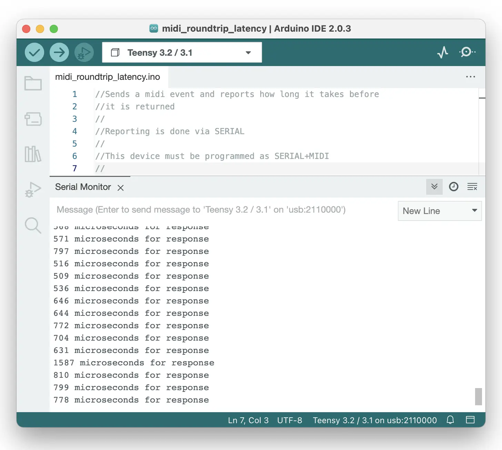

mot - MIDI and OSC Tools
------------------------

mot consists of several MIDI and OSC command line tools. These are mainly of interest to debug and check OSC messages and MIDI devices. There are applications to:
* `midi_echo`: prints MIDI messages coming from a connected MIDI device.
* `osc_echo`: prints OSC messages arriving at a certain UDP port.
* `midi_to_osc`: a MIDI to OSC bridge which sends MIDI messages coming from a connected MIDI device to an OSC target.
* `midi_roundtrip_latency`: measure MIDI round-trip latency.

## Install MIDI and OSC Tools mot

Currently, the only way to install this software is by using `cargo`, the Rust package manager. Please make sure you have [installed a recent cargo/rust version](https://www.rust-lang.org/tools/install) first.

~~~~~~
git clone --depth 1 https://github.com/JorenSix/mot.git
cd mot
cargo build --release
cargo install --path .
mot -h 
~~~~~~

These commands assume that `~/.cargo/bin` is present in the users `$PATH`. Alternatively you can copy mot to a directory more likely to be in the path:

~~~~~~
git clone --depth 1 https://github.com/JorenSix/mot.git
cd mot
cargo build --release
sudo cp target/release/mot /usr/local/bin
~~~~~~

## Command line applications in mot

`mot` works with sub-applications which are called with e.g. `mot midi_echo` to call the `midi_echo`sub application. Each sub-application also comes with a help function: `mot midi_echo -h`

~~~~~~
mot - Midi and OSC Tools

Usage: mot <COMMAND>

Commands:
  midi_to_osc             Transport MIDI over OSC
  midi_echo               Print incoming MIDI messages.
  osc_echo                Print incoming OSC messages.
  midi_roundtrip_latency  Test MIDI roundtrip latency
  help                    Print this message or the help of the given subcommand(s)

Options:
  -h, --help     Print help
  -V, --version  Print version
~~~~~~

### MIDI echo

This application prints MIDI messages which are received on a MIDI input port. There is also an option to list all input midi ports. This application is ideal to check if a) a MIDI device is correctly recognized, b) a MIDI device sends messages and c) a MIDI device sends the expected messages.

~~~~~~
mot midi_echo -l
#Listing MIDI input devices:
# Available MIDI input ports:
# 0: Teensy MIDI Port 1
mot midi_echo 0
~~~~~~

### OSC echo

This application prints OSC messages which are received on a certain UDP port. This application is ideal to check if a) a OSC messages are being received and b) the OSC messages received are in the expected place or type.

~~~~~~
mot osc_echo 127.0.0.1:6666
~~~~~~

### MIDI to OSC bridge

This application sends incoming MIDI messages over OSC to an OSC receiver. This is ideal if you want to send MIDI messages over the network. 

It also allows to create a virtual MIDI port. This can be usefull e.g. to send messages from a browser window, over MIDI, to a network. If mot is running, a browser can send messages to a virtual port which is then translated to UDP messages on a network.

~~~~~~
mot midi_to_osc 127.0.0.1:5566 /midi_transport 6666
~~~~~~

### MIDI round-trip latency

This application sends out a MIDI message as quickly as possible when a MIDI message is received. It can be used to measure MIDI round-trip latency if it is used together with the Teensy patch in the `misc` directory.  If all goes wel a relatively constanc round-trip latency of less than 1m should be no problem. An example on macOS can be seen below: 

## Browser to OSC example

One of the ways to send OSC messages from a browser to a local network is by using the MIDI out capability of browsers and - using `mot` - translating MIDI to OSC an example can be seen below.

## Credits

Joren Six @ IPEM, UGent

